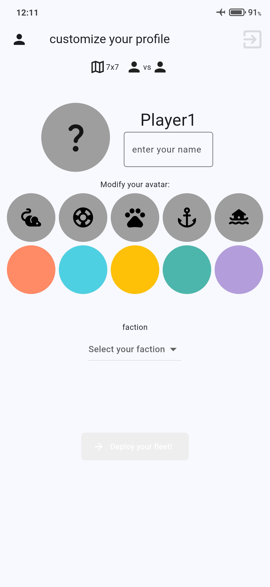
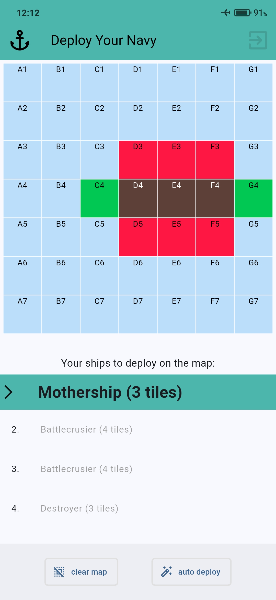
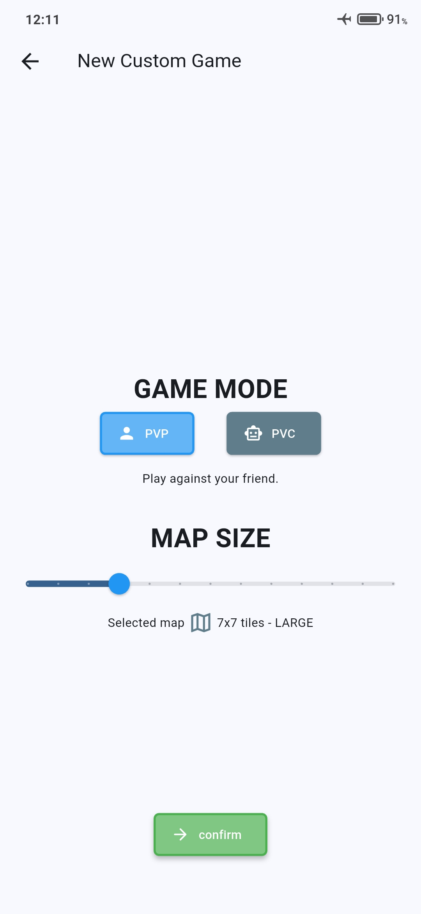
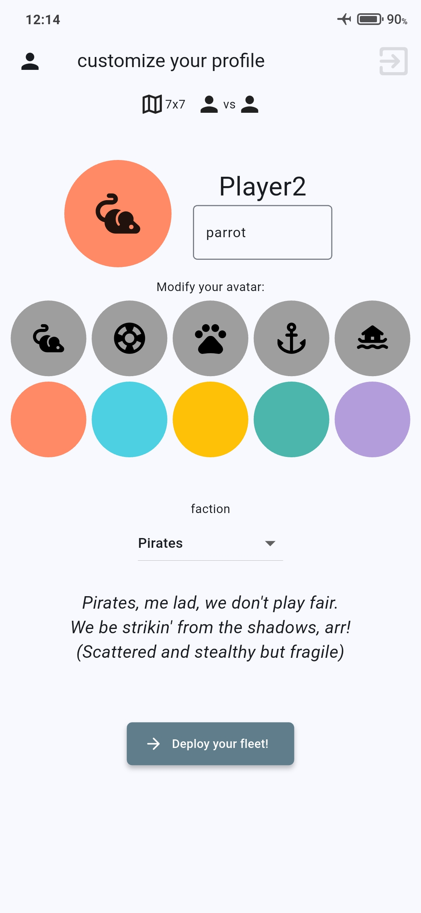
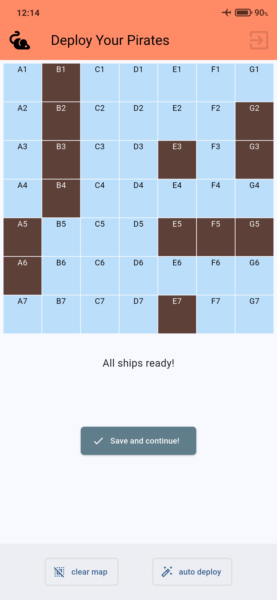
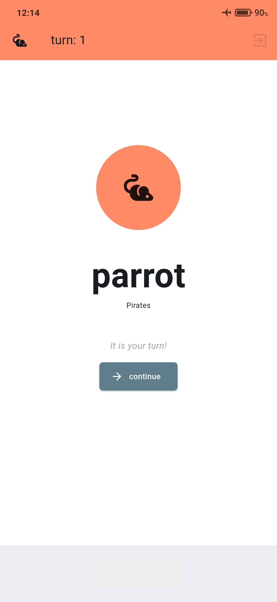
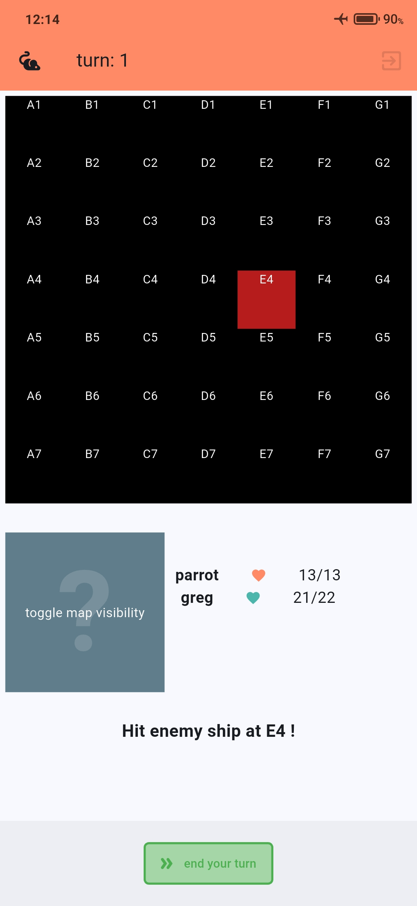
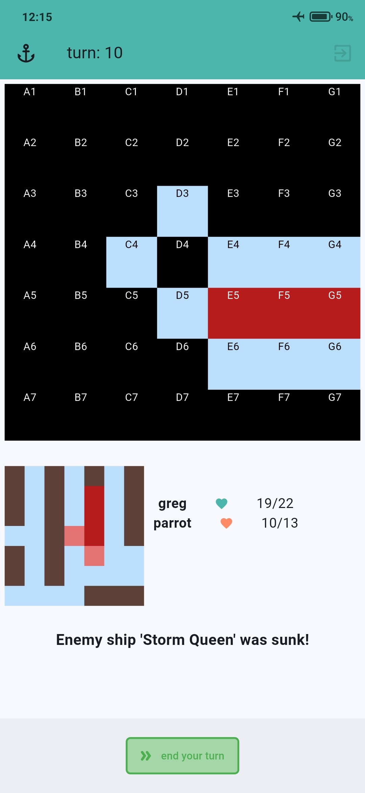
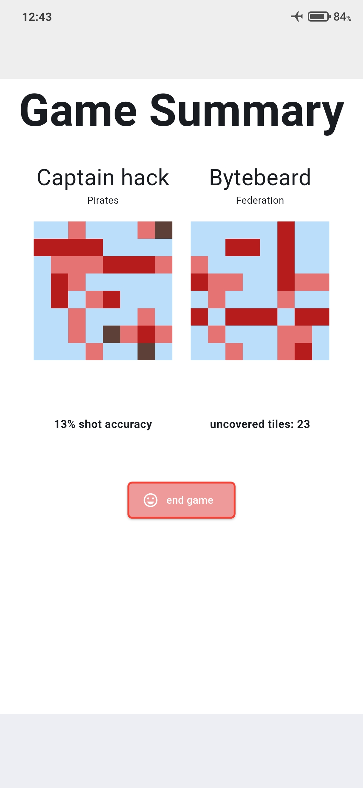

# SHIPS – Strategic Battleship Game in Flutter

**SHIPS** is a modern take on the classic Battleship game. It is my learning project built in Flutter. The app streamlines player-versus-player gameplay on a shared device and expands the traditional formula with asymmetric design!

---

## About the Game

- **hotseat PvP** battles with a clean and interactive UI
- **three unique playable factions** with their own ships and gameplay styles
- **dynamic** fleet generation based on map size and chosen faction
- manual and automatic fleet deployment
- to be introduced: **computer opponents** on various difficulty levels using reinforcement learning.

This is both a learning platform for Flutter development and a foundation for future work on AI-powered opponents using reinforcement learning.

### Preview

<p float="left">
  
  
</p>

---

## Features

- **dynamic map size** 
- **three asymmetric factions** (Navy, Pirates, Federation) with unique ship lineups
- **fully automatic ship deployment** for lazy humans or computer opponents
- **hotseat PvP mode** on a single device
- **confetti** for the winner!
- Planned expansion:
    - full implementation of **computer opponents** on various difficulty levels
    - auto-balancing between factions

---

## State Management

The app uses a custom state management system designed around modular control:

- `PreGameManager`: handles game mode, map size, and player setup (names, colors, avatars, factions, ship deployment related data)
- `GameManager`: controls core game flow and active play
- `GameEventManager`: collects in-game statistics (hits, misses, accuracies and more for both players)

---

## Tech Stack

- Flutter & Dart
- custom game logic and architecture tailored for a simple turn-based, board-style game
- external libraries:
  - [`confetti`](https://pub.dev/packages/confetti): win celebration animation
  - [`collection`](https://pub.dev/packages/collection): utilities for advanced list/set operations

---

## How to Run

   ```bash
   git clone https://github.com/9r390r/ships.git
   cd ships
   flutter pub get
   flutter run
   ```

---

## Screenshots

<h3>Game Setup</h3>
<p float="left">
  
  
  
</p>

<h3>Gameplay</h3>
<p float="left">
  
  
  
</p>

<h3>End of Game</h3>
<p float="left">
  
  
</p>